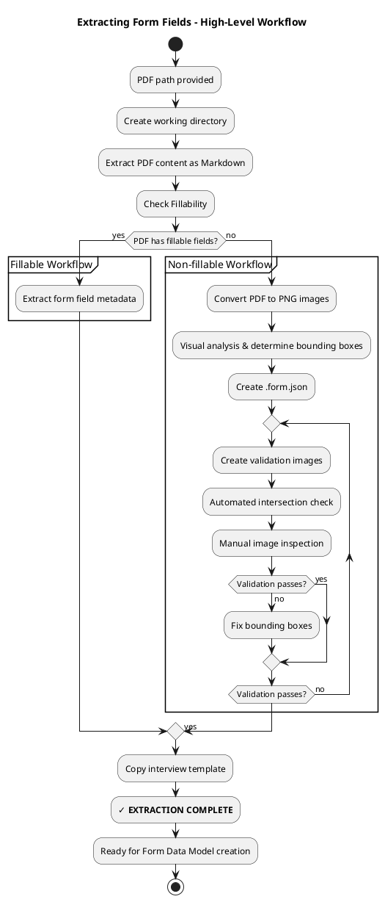

# Extracting Form Fields

Prepare working directory and extract field data from PDF forms.

<purpose>
This skill extracts PDF form information into useful JSON.
- Detects fillable vs. non-fillable PDFs
- Extracts PDF content as readable Markdown
- Creates field metadata in common JSON format
</purpose>

## Inputs

- **PDF path**: Path to PDF file (e.g., `/home/user/input.pdf`)

## Process Overview



## Process

### 1. Create Working Directory

```bash
mkdir <basename>.chatfield
```

### 2. Extract PDF Content

```bash
markitdown <pdf_path> > <basename>.chatfield/<basename>.form.md
```

### 3. Check Fillability

```bash
python scripts/check_fillable_fields.py <pdf_path>
```

**Output:**
- `"This PDF has fillable form fields"` → use fillable workflow
- `"This PDF does not have fillable form fields; you will need to visually determine where to enter data"` → use non-fillable workflow

### 4. Branch Based on Fillability

#### If Fillable:

Follow ./references/fillable-forms.md

#### If Non-fillable:

Follow ./references/nonfillable-forms.md

### 5. Copy Interview Template

Copy a file from the included `filling-pdf-forms` skill's template. The path below is relative to this file.

```bash
cp ../filling-pdf-forms/scripts/chatfield_interview_template.py <basename>.chatfield/interview.py
```

## Output Format

### Fillable PDFs - .form.json

```json
[
  {
    "field_id": "topmostSubform[0].Page1[0].f1_01[0]",
    "type": "text",
    "page": 1,
    "rect": [100, 200, 300, 220],
    "tooltip": "Enter your full legal name",
    "max_length": null
  },
  {
    "field_id": "checkbox_over_18",
    "type": "checkbox",
    "page": 1,
    "rect": [150, 250, 165, 265],
    "checked_value": "/1",
    "unchecked_value": "/Off"
  }
]
```

## References

- ./references/fillable-forms.md - Fillable PDF extraction workflow
- ./references/nonfillable-forms.md - Non-fillable PDF extraction workflow