# Fillable PDF Forms - Extraction Guide

This guide is for the "extracting-form-fields" agent performing extraction on fillable PDFs.

## Process Overview

```plantuml
@startuml fillable-forms
title Fillable PDF Forms - Extraction Workflow
start
:Prerequisites: Working directory created,
PDF content extracted as Markdown;
:Extract form field metadata;
:**✓ FILLABLE EXTRACTION COMPLETE**;
stop
@enduml
```



## Extraction Process

### 1. Extract Form Field Metadata

```bash
python scripts/extract_form_field_info.py input.pdf input.chatfield/input.form.json
```

This creates a JSON file with field metadata:

## Completion Report

After extraction, simply state "Done". If there is an unrecoverable error, halt and report the error verbatim.