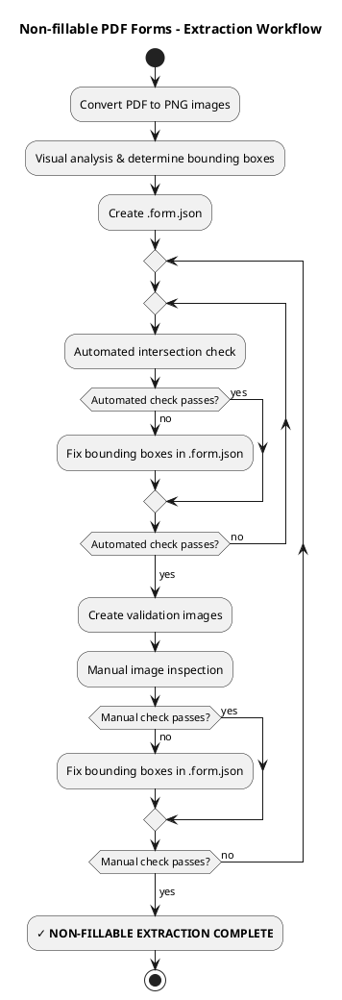

# Non-fillable PDF Forms - Extraction Guide

You'll need to visually determine where the data should be added as text annotations. Follow the below steps *exactly*. You MUST perform all of these steps to ensure that the the form is accurately completed. Details for each step are below.
- Convert the PDF to PNG images and determine field bounding boxes.
- Create a JSON file with field information and validation images showing the bounding boxes.
- Validate the the bounding boxes.

## Process Overview



## Extraction Process

## Step 1: Visual Analysis (REQUIRED)
- Convert the PDF to PNG images. Run this script from this skill's directory:
`python scripts/convert_pdf_to_images.py <file.pdf> <path to basename.chatfield dir> The script will create a PNG image for each page in the PDF.
- Read and analyze the the .form.md file which is a Markdown text preview of the PDF content
- Carefully examine each PNG image and identify all form fields and areas where the user should enter data. For each form field where the user should enter text, determine bounding boxes for both the form field label, and the area where the user should enter text. The label and entry bounding boxes MUST NOT INTERSECT; the text entry box should only include the area where data should be entered. Usually this area will be immediately to the side, above, or below its label. Entry bounding boxes must be tall and wide enough to contain their text.

These are some examples of form structures that you might see (in English, but the form can be any language):

*Label inside box*
```
┌────────────────────────┐
│ Name:                  │
└────────────────────────┘
```
The input area should be to the right of the "Name" label and extend to the edge of the box.

*Label before line*
```
Email: _______________________
```
The input area should be above the line and include its entire width.

*Label under line*
```
_________________________
Name
```
The input area should be above the line and include the entire width of the line. This is common for signature and date fields.

*Label above line*
```
Please enter any special requests:
________________________________________________
```
The input area should extend from the bottom of the label to the line, and should include the entire width of the line.

*Checkboxes*
```
Are you a US citizen? Yes □  No □
```
For checkboxes:
- Look for small square boxes (□) - these are the actual checkboxes to target. They may be to the left or right of their labels.
- Distinguish between label text ("Yes", "No") and the clickable checkbox squares.
- The entry bounding box should cover ONLY the small square, not the text label.

## Step 2: Create .form.json

Create `<basename>.chatfield/<basename>.form.json` with field definitions in the format of this example:

```json
[
  {
    "field_id": "full_name",
    "type": "text",
    "page": 1,
    "rect": [160, 700, 500, 720],
    "label_text": "Full Name:",
    "label_rect": [50, 700, 150, 720]
  },
  {
    "field_id": "is_citizen",
    "type": "checkbox",
    "page": 1,
    "rect": [155, 650, 170, 665],
    "label_text": "US Citizen",
    "label_rect": [50, 650, 150, 670],
    "checked_value": "X",
    "unchecked_value": ""
  }
]
```

**Field structure:**
- `field_id` - Unique identifier (will be used in chatfield definition)
- `type` - "text" or "checkbox"
- `page` - Page number (1-indexed)
- `rect` - Entry area bounding box [x1, y1, x2, y2] where data will be written
- `label_text` - Optional label text for this field
- `label_rect` - Optional label bounding box [x1, y1, x2, y2]
- For checkboxes only:
  - `checked_value` - String to write when checked (typically "X" or "✓")
  - `unchecked_value` - String to write when unchecked (typically "")

**Bounding box coordinates:**
- PDF coordinate system: Origin (0,0) at bottom-left
- Format: `[x1, y1, x2, y2]` where (x1,y1) is bottom-left, (x2,y2) is top-right
- Entry boxes (`rect`) must be tall and wide enough to contain text
- Label boxes (`label_rect`) should contain the label text
- Entry and label boxes MUST NOT overlap
- Checkboxes should be at least 15x15 pixels

## Step 3. Validate Bounding Boxes (REQUIRED)

This is a two-stage validation process. You must pass the automated check before proceeding to manual inspection.

### Stage 1: Automated intersection check

Run the automated check script:

```bash
python scripts/check_bounding_boxes.py <basename>.chatfield/<basename>.form.json
```

**What it checks:**
- Label/entry bounding box intersections (must not overlap)
- Boxes outside page boundaries
- Boxes too small to contain text
- Missing required fields

**If there are errors:** Fix the bounding boxes in `.form.json` and re-run the automated check. Iterate until there are no remaining errors.

**Only proceed to Stage 2 once all automated checks pass.**

### Stage 2: Manual image inspection

First, create validation images for each page:

```bash
# For each page (e.g., if you have 3 pages)
python scripts/create_validation_image.py 1 <basename>.chatfield/<basename>.form.json <basename>.chatfield/images/page_1.png <basename>.chatfield/images/page_1_validation.png
python scripts/create_validation_image.py 2 <basename>.chatfield/<basename>.form.json <basename>.chatfield/images/page_2.png <basename>.chatfield/images/page_2_validation.png
python scripts/create_validation_image.py 3 <basename>.chatfield/<basename>.form.json <basename>.chatfield/images/page_3.png <basename>.chatfield/images/page_3_validation.png
```

This overlays colored rectangles (red for entry boxes, blue for labels) on the PNG images to visualize bounding boxes.

**CRITICAL: Visually inspect validation images**

Remember: label (blue) bounding boxes should contain text labels, entry (red) boxes should not.
- Red rectangles must ONLY cover input areas
- Red rectangles MUST NOT contain any text
- Blue rectangles should contain label text
- For checkboxes:
  - Red rectangle MUST be centered on the checkbox square
  - Blue rectangle should cover the text label for the checkbox

**If any rectangles look wrong:** Fix bounding boxes in `.form.json`, then return to Stage 1 (automated check gate). You must pass both stages again.

## Troubleshooting

**Bounding boxes don't align:**
- Review validation
- Adjust coordinates in `.form.json`
- Remember: PDF coordinates start at bottom-left (0,0)
- Re-run validation after changes

**Text gets cut off:**
- Increase bounding box height and/or width
- Entry boxes should have extra space for text

**Validation script errors:**
- Ensure all page images exist in `images/` directory
- Verify JSON syntax in `.form.json`
- Check that page numbers are 1-indexed

---

**See Also:**
- ../../filling-pdf-forms/references/converting-pdf-to-chatfield.md - How the main skill builds the interview
- ./fillable-forms.md - Alternative extraction for fillable PDFs
- ../../filling-pdf-forms/references/populating.md - How bounding boxes are used during PDF population