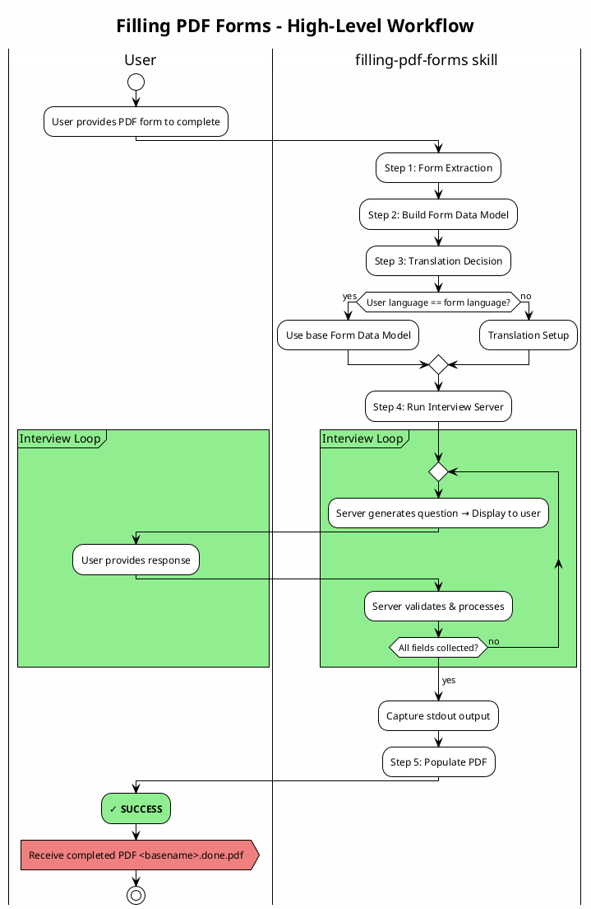

# Filling PDF Forms

Complete PDF forms by collecting required data through conversational interviews and populating form fields.

## When to Use This Skill

Use when completing PDF forms with user-provided data. Your goal is to produce a `.done.pdf` corresponding to the user's starting PDF file, populated with the user-provided information.

## Process Overview



## Workflow

### Step 1: Form Extraction

Use the `extracting-form-fields` sub-agent to extract the PDF form into useful files.

**Invoke via Task tool:**

```python
Task(
    subagent_type="general-purpose",
    description="Extract PDF form fields",
    prompt=f"""
    Extract form field data from PDF: {pdf_absolute_path}

    Use the extracting-form-fields skill to complete this task.
    """
)
```

When the task reports "Done", it will have created (for `input.pdf`):
- `input.chatfield/` directory
- `input.chatfield/input.form.md` - PDF content as Markdown
- `input.chatfield/input.form.json` - Form field definitions
- `input.chatfield/interview.py` - Template Form Data Model file ready for editing

### Step 2: Build Form Data Model

Edit `[basename].chatfield/interview.py` to define the Chatfield interview.

**See:** ./references/converting-pdf-to-chatfield.md for mandatory guidance.

This step creates the **Form Data Model** - the faithful representation of the PDF form using the Chatfield data model API.

**Key steps:**
- Read `.form.md` for form knowledge (purpose, instructions, context)
- Read `.form.json` for field IDs and types
- Build Form Data Model using chatfield builder API
- Match the form's language in all strings
- Use validation checklist before proceeding

### Step 3: Translation (If Needed)

Determine if translation is needed.

#### When Translation is Needed

**Explicit**: User states "I need to fill this Spanish form but I only speak English"

**Implicit**: User request is in language X, but PDF is in language Y
- Example: "Help me complete form.es.pdf" (English request, Spanish form)

**To apply translation, see:** ./references/translating.md

Translation creates `interview_<lang>.py` and **re-defines** the Form Data Model from `interview.py` to the new `interview_<lang>.py` instead. Henceforth, use the translated file as the Form Data Model.

### Step 4: Run Interview Server

Run the Chatfield interview server with the Form Data Model:

```bash
# Using base Form Data Model (same language):
python -m chatfield.server input.chatfield/interview.py

# OR using translated Form Data Model:
python -m chatfield.server input.chatfield/interview_es.py
```

Server will:
1. Start conversational interview
2. Collect data from user
3. Output results to stdout
4. Exit when complete

Capture the stdout output - you'll need it for population.

### Step 5: Populate PDF

Parse server output and populate the PDF.

**See:** ./references/populating.md

**Steps:**
1. Parse server stdout to extract field values
2. Create `.values.json` with proper format
3. Run population script:
   ```bash
   python scripts/fill_fillable_fields.py input.pdf input.values.json input.done.pdf
   ```
4. Verify output PDF exists

**Result**: `input.done.pdf`
