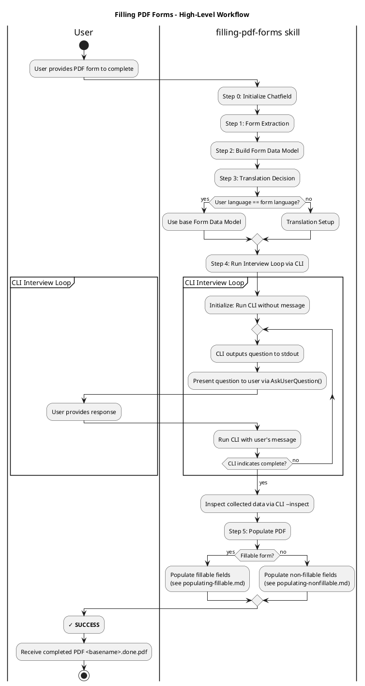

# Filling PDF Forms

Complete PDF forms by collecting required data through conversational interviews and populating form fields.

<purpose>
Use when completing PDF forms with user-provided data. Goal: produce `.done.pdf` populated with user information by following this process exactly.
</purpose>

## Process Overview



## Workflow

### Step 0: Initialize Chatfield

Test for and install missing packages:
- `pypdf`
- `pdf2image`
- `markitdown` → `pip install "markitdown[pdf]"`
- `chatfield` → `pip install ./scripts/chatfield-1.0.0a2-py3-none-any.whl` (path relative to this .md)

### Step 1: Form Extraction

Extract PDF form using `extracting-form-fields` sub-agent:

```python
Task(
    subagent_type="general-purpose",
    description="Extract PDF form fields",
    prompt=f"Extract form field data from PDF: {pdf_path}\n\nUse the extracting-form-fields skill."
)
```

**Task reports**: "fillable" or "non-fillable" (needed for Step 5)

**Creates** (for `input.pdf`):
- `input.chatfield/input.form.md` - PDF as Markdown
- `input.chatfield/input.form.json` - Field definitions
- `input.chatfield/interview.py` - Template Form Data Model

### Step 2: Build Form Data Model

1. Read entirely: `./references/data-model-api.md` - Learn Chatfield API
2. Read entirely: `./references/converting-pdf-to-chatfield.md` - PDF→Chatfield Form Data Model guidance
3. Edit `<basename>.chatfield/interview.py` - Define Form Data Model

**Result**: The **Form Data Model**, a faithful representation of PDF form using Chatfield API.

### Step 3: Translation (If Needed)

Determine if translation is needed.

#### When Translation is Needed

**Explicit**: User states "I need to fill this Spanish form but I only speak English"

**Implicit**: User request is in language X, but PDF is in language Y
- Example: "Help me complete form.es.pdf" (English request, Spanish form)

**To apply translation, see:** ./references/translating.md

Translation creates `interview_<lang>.py` and **re-defines** the Form Data Model from `interview.py` to the new `interview_<lang>.py` instead. Henceforth, use the translated file as the Form Data Model.

### Step 4: Run Interview Loop via CLI

**CRITICAL**: See `./references/CLI-INTERVIEW-LOOP.md` for complete MANDATORY execution rules.


### Step 5: Populate PDF

Parse `--inspect` output and populate the PDF.

#### If Fillable:

**See:** ./references/populating-fillable.md

#### If Non-fillable:

**See:** ./references/populating-nonfillable.md

**Result**: `<basename>.done.pdf`
