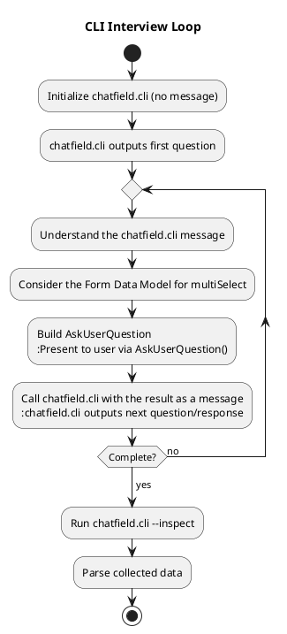

# CLI Interview Loop

**CRITICAL: Strict adherence required. No deviations permitted.**

Run `chatfield.cli` iteratively, presenting its output messages via AskUserQuestion(), passing responses back, repeating until complete.

**Files:**
- State: `<basename>.chatfield/interview.db`
- Interview: `<basename>.chatfield/interview.py` (or `interview_<lang>.py` if translated)

## Workflow Overview



## CLI Command Reference

```bash
# Initialize (NO user message)
python -m chatfield.cli --state=<state> --interview=<interview>

# Continue (WITH message)
python -m chatfield.cli --state=<state> --interview=<interview> "user response"

# Inspect (when complete, or any time to troubleshoot)
python -m chatfield.cli --state=<state> --interview=<interview> --inspect
```

In all cases, chatfield.cli will print to its stdout a message for the user.

## Interview Loop Process

**CRITICAL**: When building AskUserQuestion from chatfield.cli's message, you MUST strictly follow ./AskUserQuestion-RULES.md

1. Initialize: `python -m chatfield.cli --state=<state> --interview=<interview>` (NO message)
2. Read chatfield.cli's stdout message
3. Recall or look up Form Data Model for multiSelect (`.as_multi()`, `.one_or_more()` → True)
4. Build AskUserQuestion per mandatory rules: ./AskUserQuestion-RULES.md
5. Present AskUserQuestion to user
6. Handle response:
   - "Other" text → pass to chatfield.cli
   - "Skip" → pass "skip" or equivalent paraphrase to chatfield.cli
   - "Delegate" → research answer, pass to chatfield.cli
   - Options 3-4 → pass selection to chatfield.cli
   - Multi-select → join with commas, pass to chatfield.cli
7. Call: `python -m chatfield.cli --state=<state> --interview=<interview> "user response"`
8. Repeat steps 2-7 until completion signal
9. Run: `python -m chatfield.cli --state=<state> --interview=<interview> --inspect`

## Completion Signals

Watch for:
- "Thank you! I have all the information I need."
- "complete" / "done"

When Chatfield mentions the conversation is complete, stop the loop. The CLI Interview loop is done.