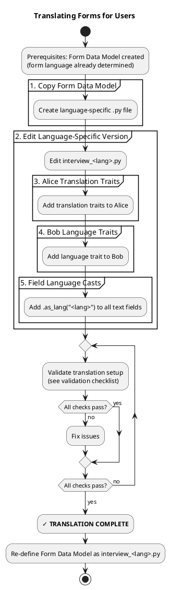

# Translating Forms for Users

<purpose>
Use this guide when the PDF form is in a language different from the user's language. This enables cross-language form completion where the user speaks one language and the form is in another.
</purpose>

## Process Overview



## Critical Principle

<critical_principle>
The **Form Data Model** (`interview.py`) was already created with the form's language.

**DO NOT recreate it.** Instead, ADAPT it for translation.

The form definition stays in the form's language. Only Alice's behavior and Bob's profile are modified to enable translation.
</critical_principle>

## Process

### 1. Copy Form Data Model

Create a language-specific .py file. Use ISO 639-1 language codes: `en`, `es`, `fr`, `de`, `zh`, `ja`, etc.

```bash
# If user speaks Spanish
cp input.chatfield/interview.py input.chatfield/interview_es.py
```

### 2. Edit Language-Specific Version

Edit `interview_<lang>.py` to add translation traits.

**What to change:**
- ✅ Alice traits - Add translation instructions
- ✅ Bob traits - Add language preference
- ✅ Text fields - Add `.as_lang("<form-lang-code>")` for translation (e.g., "es" for Spanish)

**What NOT to change:**
- ❌ Form `.type()` or `.desc()` - Keep form's language
- ❌ Field definitions - Keep all field IDs unchanged
- ❌ Field `.desc()` - Keep form's language
- ❌ Background hints - Keep form's language
- ❌ Any field IDs or cast names

### 3. Alice Translation Traits

Add these traits to Alice:

```python
.alice()
    # Keep existing .type()
    .trait("Conducts this conversation in [USER_LANGUAGE]")
    .trait("Translates [USER_LANGUAGE] responses into [FORM_LANGUAGE] for the form")
    .trait("Explains [FORM_LANGUAGE] terms in [USER_LANGUAGE]")
    # Keep all existing .trait() calls
```

### 4. Bob Language Traits

Add these traits to Bob:

```python
.bob()
    # Keep existing .type()
    .trait("Speaks [USER_LANGUAGE] only")
    # Keep all existing .trait() calls
```

### 5. Field Language Casts

Add `.as_lang("<form-lang-code>")` to **all text fields** to ensure values are translated to the form's language using ISO 639-1 language codes (es, fr, th, de, etc.):

```python
.field("field_name")
    .desc("...")
    .as_lang("es")  # For Spanish form, use "fr" for French, "th" for Thai, etc.
    # Keep all existing casts
```

## Complete Example

**Original Form Data Model** (`interview.py`):

```python
from chatfield import chatfield

interview = (chatfield()
    .type("Solicitud de Visa")
    .desc("Formulario de solicitud de visa de turista")

    .alice()
        .type("Asistente de Formularios")
        .trait("Usa lenguaje claro y natural")
        .trait("Acepta variaciones de formato")

    .bob()
        .type("Solicitante de visa")
        .trait("Habla de forma natural y libre")

    .field("nombre_completo")
        .desc("¿Cuál es su nombre completo?")
        .hint("Background: Debe coincidir con el pasaporte")

    .field("fecha_nacimiento")
        .desc("¿Cuál es su fecha de nacimiento?")
        .as_str("dia", "Día (DD)")
        .as_str("mes", "Mes (MM)")
        .as_str("anio", "Año (YYYY)")

    .build()
)
```

**Translated Version** (`interview_en.py` for English-speaking user):

```python
from chatfield import chatfield

interview = (chatfield()
    .type("Solicitud de Visa")  # Unchanged - form's language
    .desc("Formulario de solicitud de visa de turista")  # Unchanged

    .alice()
        .type("Asistente de Formularios")  # Unchanged
        .trait("Conducts this conversation in English")  # ADDED
        .trait("Translates English responses into Spanish for the form")  # ADDED
        .trait("Explains Spanish terms in English")  # ADDED
        .trait("Usa lenguaje claro y natural")  # Keep existing
        .trait("Acepta variaciones de formato")  # Keep existing

    .bob()
        .type("Solicitante de visa")  # Unchanged
        .trait("Speaks English only")  # ADDED
        .trait("Habla de forma natural y libre")  # Keep existing

    .field("nombre_completo")  # Unchanged
        .desc("¿Cuál es su nombre completo?")  # Unchanged - form's language
        .hint("Background: Debe coincidir con el pasaporte")  # Unchanged
        .as_lang("es")  # ADDED - translate to Spanish

    .field("fecha_nacimiento")  # Unchanged
        .desc("¿Cuál es su fecha de nacimiento?")  # Unchanged
        .as_str("dia", "Día (DD)")  # Unchanged
        .as_str("mes", "Mes (MM)")  # Unchanged
        .as_str("anio", "Año (YYYY)")  # Unchanged

    .build()
)
```

## Validation Checklist

Before proceeding, verify ALL items:

<validation_checklist>
```
Translation Validation Checklist:
- [ ] Created interview_<lang>.py (copied from interview.py)
- [ ] No changes to form .type() or .desc()
- [ ] No changes to field definitions (field IDs)
- [ ] No changes to field .desc() (keep form's language)
- [ ] No changes to .as_*() cast names or descriptions
- [ ] No changes to Background hints (keep form's language)
- [ ] Added Alice trait: "Conducts this conversation in [USER_LANGUAGE]"
- [ ] Added Alice trait: "Translates [USER_LANGUAGE] responses into [FORM_LANGUAGE]"
- [ ] Added Alice trait: "Explains [FORM_LANGUAGE] terms in [USER_LANGUAGE]"
- [ ] Added Bob trait: "Speaks [USER_LANGUAGE] only"
- [ ] Added .as_lang("<form-lang-code>") to all text fields (e.g., "es" for Spanish)
```
</validation_checklist>

If any items fail:
1. Review the specific issue
2. Fix the interview definition
3. Re-run validation checklist
4. Proceed only when all items pass

## Re-define Form Data Model

**CRITICAL**: When translation setup is complete, the **Form Data Model** is now the language-specific version (`interview_<lang>.py`), NOT the base `interview.py`.

Use this file for all subsequent steps (CLI execution, etc.).