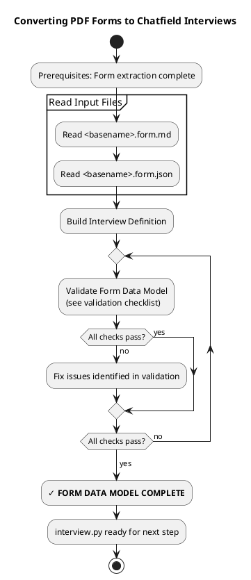

# Converting PDF Forms to Chatfield Interviews

<purpose>
This guide covers how to build a Chatfield interview definition from PDF form data. This is the core transformation step that converts a static PDF form into a conversational interview.
</purpose>

<important>
**Read complete API reference**: See ./data-model-api.md for all builder methods, transformations, and validation rules.
</important>

## Process Overview



## The Form Data Model

<definition>
The **Form Data Model** is the `interview.py` file in the `.chatfield/` working directory. This file contains the chatfield builder definition that faithfully represents the PDF form.
</definition>

## Critical Principle: Faithfulness to Original PDF

<critical_principle>
**The Form Data Model must be as accurate and faithful as possible to the source PDF.**

**Why?** Downstream code will NOT see the PDF anymore. The interview must create the "illusion" that the AI agent has full access to the form, speaking to the user, writing information - all from the Form Data Model alone.

This means every field, every instruction, every validation rule from the PDF must be captured in the interview definition.
</critical_principle>

## Language Matching Rule

**CRITICAL: Only pass English-language strings to the chatfield builder API for English-language forms.**

The chatfield object strings should virtually always match the PDF's primary language:
- `.type()` - Use short identifier (e.g., "DHFS_FoodBusinessLicense"), not full official name. **HARD LIMIT: 64 characters maximum**
- `.desc()` - Use form's language
- `.trait()` - Use form's language for Background content
- `.hint()` - Use form's language

**Translation happens LATER** (see ./translating.md), not during initial definition.

## Key Rules

These fundamental rules apply to all Form Data Models:

1. **Faithfulness to PDF**: The interview definition must accurately represent the source PDF form
2. **Short type identifiers**: Top-level `.type()` should be a short "class name" identifier (e.g., "W9_TIN", "DHFS_FoodBusinessLicense"), not the full official form name. **HARD LIMIT: 64 characters maximum**
3. **Direct mapping default**: Use PDF field_ids directly from `.form.json` unless using fan-out patterns
4. **Fan-out patterns**: Use `.as_*()` casts to populate multiple PDF fields from single collected value
5. **Exact field_ids**: Keep field IDs from `.form.json` unchanged (use as cast names or direct field names)
6. **Extract knowledge**: ALL form instructions go into Alice traits/hints
7. **Format flexibility**: Never specify format in `.desc()` - Alice accepts variations
8. **Validation vs transformation**: `.must()` for content constraints (use SPARINGLY), `.as_*()` for formatting (use LIBERALLY). Alice NEVER mentions format requirements to Bob
9. **Language matching**: All strings (`.desc()`, `.trait()`, `.hint()`) must match the PDF's language

## Reading Input Files

Your inputs from form-extract:
- **`<basename>.chatfield/<basename>.form.md`** - PDF content as Markdown (use this for form knowledge)
- **`<basename>.chatfield/<basename>.form.json`** - Field IDs, types, and metadata

## Extracting Form Knowledge

From `.form.md`, extract ONLY actionable knowledge:
- Form purpose (1-2 sentences)
- Key term definitions
- Field completion instructions
- Valid options/codes
- Decision logic ("If X then Y")

**Do NOT extract:**
- Decorative text
- Repeated boilerplate
- Page numbers, footers

Place extracted knowledge in interview:
- **Form-level** → Alice traits: `.trait("Background: [context]...")`
- **Field-level** → Field hints: `.hint("Background: [guidance]")`

## Builder API Patterns

### Direct Mapping (Default)

One PDF field_id → one question

```python
.field("topmostSubform[0].Page1[0].f1_01[0]")
    .desc("What is your full legal name?")  # English .desc() for English form
    .hint("Background: Should match official records")
```

### Fan-out Pattern

Collect once, populate multiple PDF fields via `.as_*()` casts

```python
.field("age")
    .desc("What is your age in years?")
    .as_int("age_years", "Age as integer")
    .as_bool("over_18", "True if 18 or older")
    .as_str("age_display", "Age formatted for display")
```

**CRITICAL**: Cast names MUST be exact PDF field_ids from `.form.json`

### Discriminate + Split Pattern

Mutually-exclusive fields

```python
.field("tin")
    .desc("Is your taxpayer ID an EIN or SSN, and what is the number?")
    .must("be exactly 9 digits")
    .must("indicate SSN or EIN type")
    .as_str("ssn_part1", "First 3 of SSN, or empty if N/A")
    .as_str("ssn_part2", "Middle 2 of SSN, or empty if N/A")
    .as_str("ssn_part3", "Last 4 of SSN, or empty if N/A")
    .as_str("ein_full", "Full 9-digit EIN, or empty if N/A")
```

### Expand Pattern

Multiple checkboxes from single field

```python
.field("preferences")
    .desc("What are your communication preferences?")
    .as_bool("email_ok", "True if wants email")
    .as_bool("phone_ok", "True if wants phone calls")
    .as_bool("mail_ok", "True if wants postal mail")
```

## `.must()` vs `.as_*()` Usage

**`.must()`** - CONTENT constraints (use SPARINGLY):
- Only when field MUST contain specific information
- Creates hard blocking constraint
- Example: `.must("match tax return exactly")`

**`.as_*()`** - TYPE/FORMAT transformations (use LIBERALLY):
- For any type casting, formatting, derived values
- Alice accepts variations, computes transformation
- Example: `.as_int()`, `.as_bool()`, `.as_str("name", "desc")`

**Rule of thumb**: Expect MORE `.as_*()` calls than `.must()` calls.

## Field Types

- **Text** → `.field("id").desc("question")`
- **Checkbox** → `.field("id").desc("question").as_bool()`
- **Radio/choice (required)** → `.field("id").desc("question").as_one("opt1", "opt2")`
- **Radio/choice (optional)** → `.field("id").desc("question").as_nullable_one("opt1", "opt2")`

## Optional Fields

```python
.field("middle_name")
    .desc("Middle name")
    .hint("Background: Optional per form instructions")
```

## Hint Conventions

All hints must have a prefix:

- **"Background:"** - Internal notes for Alice only
  - Alice uses these for formatting, conversions, context without mentioning to Bob
  - Example: `.hint("Background: Convert to Buddhist calendar by adding 543 years")`
- **"Tooltip:"** - May be shared with Bob if helpful
  - Example: `.hint("Tooltip: Your employer provides this number")`

**See ./data-model-api.md** for complete list of transformations (`.as_int()`, `.as_bool()`, etc.) and cardinality options (`.as_one()`, `.as_multi()`, etc.).

## When to Use `.conclude()`

Only when derived field depends on multiple previous fields OR complex logic that can't be expressed in a single field's casts.

## Additional Guidance from PDF Forms

**Extract Knowledge Wisely:**
- Extract actionable knowledge ONLY from PDF
- Form purpose (1-2 sentences max)
- Key term definitions
- Field completion instructions
- Valid options/codes
- Decision logic ("If X then Y")
- **Do NOT extract**: Decorative text, repeated boilerplate, page numbers, footers

**Alice Traits for Format Flexibility:**
```python
.alice()
    .type("Form Assistant")
    .trait("Collects information content naturally, handling all formatting invisibly")
    .trait("Accepts format variations (SSN with/without hyphens)")
    .trait("Background: [extracted form knowledge goes here]")
```

**Default to Direct Mapping:**
PDF field_ids are internal - users only see `.desc()`. Use field IDs directly unless using fan-out patterns.

**Format Flexibility:**
Never specify format in `.desc()` - Alice accepts variations. Use `.as_*()` for formatting requirements.

## Complete Example

```python
from chatfield import chatfield

interview = (chatfield()
    .type("W9_TIN")
    .desc("Form to provide TIN to entities paying income")

    .alice()
        .type("Tax Form Assistant")
        .trait("Collects information content naturally, handling all formatting invisibly")
        .trait("Accepts format variations (SSN with/without hyphens)")
        .trait("Background: W-9 used to provide TIN to entities paying income")
        .trait("Background: EIN for business entities, SSN for individuals")

    .bob()
        .type("Taxpayer completing W-9 form")
        .trait("Speaks naturally and freely")

    .field("name")
        .desc("What is your full legal name as shown on your tax return?")
        .hint("Background: Must match IRS records exactly")

    .field("business_name")
        .desc("Business name or disregarded entity name, if different from above")
        .hint("Background: Optional - only if applicable")

    .field("tin")
        .desc("What is your taxpayer identification number (SSN or EIN)?")
        .must("be exactly 9 digits")
        .must("indicate whether SSN or EIN")
        .as_str("ssn_part1", "First 3 digits of SSN, or empty if using EIN")
        .as_str("ssn_part2", "Middle 2 digits of SSN, or empty if using EIN")
        .as_str("ssn_part3", "Last 4 digits of SSN, or empty if using EIN")
        .as_str("ein_part1", "First 2 digits of EIN, or empty if using SSN")
        .as_str("ein_part2", "Last 7 digits of EIN, or empty if using SSN")

    .field("address")
        .desc("What is your address (number, street, apt/suite)?")

    .field("city_state_zip")
        .desc("What is your city, state, and ZIP code?")
        .as_str("city", "City name")
        .as_str("state", "State abbreviation (2 letters)")
        .as_str("zip", "ZIP code")

    .build()
)
```

## Validation Checklist

Before proceeding, validate the interview definition:

<validation_checklist>
```
Interview Validation Checklist:
- [ ] All field_ids from .form.json are mapped
- [ ] No field_ids duplicated or missing
- [ ] .desc() describes WHAT information is needed (content), never HOW it should be formatted
- [ ] .hint() provides context about content (e.g., "Optional", "Must match passport"), never formatting instructions
- [ ] All formatting requirements (dates, codes, number formats, etc.) use .as_*() transformations exclusively
- [ ] Fan-out patterns use .as_*() with PDF field_ids as cast names
- [ ] Split patterns use .as_*() with "or empty/0 if N/A" descriptions
- [ ] Discriminate + split uses .as_*() for mutually-exclusive fields
- [ ] Expand pattern uses .as_*() casts on single field
- [ ] .conclude() used only when necessary (multi-field dependencies)
- [ ] Alice traits include extracted form knowledge
- [ ] Field hints provide context from PDF instructions
- [ ] Optional fields explicitly marked with hint("Background: Optional...")
- [ ] .must() used sparingly (only true content requirements)
- [ ] Field .desc() questions are natural and user-friendly (no technical field_ids)
- [ ] ALL STRINGS match the PDF's primary language
```
</validation_checklist>

If any items fail:
1. Review the specific issue
2. Fix the interview definition
3. Re-run validation checklist
4. Proceed only when all items pass

## The Result: Form Data Model

When validation passes, you have successfully created the **Form Data Model** in `<basename>.chatfield/interview.py`.

This file will be referenced in later steps for:
- Translation (if needed - see ./translating.md)
- Server execution (`python -m chatfield.server <basename>.chatfield/interview.py`)

---

**Next Steps:**
- If user's language ≠ form's language → See ./translating.md
- If user's language = form's language → Skip to server execution
