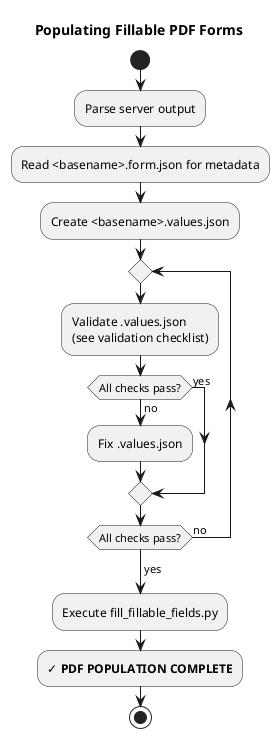

# Populating Fillable PDF Forms

<purpose>
After collecting data via Chatfield interview, populate fillable PDF forms with the results.
</purpose>

## Process Overview



## Process

### 1. Parse Server Output

The server stdout will contain logs of the data collection and also a final summary of all data pretty-printed.

Extract `field_id` and the proper value for each field.

### 2. Create `.values.json`

Create `<basename>.values.json` in the `<basename>.chatfield/` directory with the collected field values:

```json
[
  {"field_id": "name", "page": 1, "value": "John Doe"},
  {"field_id": "age_years", "page": 1, "value": 25},
  {"field_id": "age_display", "page": 1, "value": "25"},
  {"field_id": "checkbox_over_18", "page": 1, "value": "/1"}
]
```

**Value selection priority:**
- **CRITICAL**: If a language cast exists for a field (e.g., `.as_lang_es`, `.as_lang_fr`), **always prefer it** over the raw value
- This ensures forms are populated in the form's language, not the conversation language
- The language cast name matches the form's language code (e.g., `as_lang_es` for Spanish forms)
- Only use the raw value if no language cast exists

**Boolean conversion for checkboxes:**
- Read `.form.json` for `checked_value` and `unchecked_value`
- Typically: `"/1"` or `"/On"` for checked, `"/Off"` for unchecked
- Convert Python `True`/`False` → PDF checkbox values

### 3. Validate `.values.json`

**Before running the population script**, validate the `.values.json` file against the validation checklist below:
- Verify all field_ids from `.form.json` are present
- Check checkbox values match `checked_value`/`unchecked_value` from `.form.json`
- Ensure numeric fields use numbers, not strings
- Confirm language cast values are used when available

If validation fails, fix the `.values.json` file and re-validate until all checks pass.

### 4. Populate PDF

Once validation passes, run the population script (note, the `scripts` directory is relative to the base directory for this skill):

```bash
python scripts/fill_fillable_fields.py <basename>.pdf <basename>.chatfield/<basename>.values.json <basename>.done.pdf
```

## Complete Example

```bash
# 1. Parse server output (manual extraction from stdout)
# Server printed: {'name': {'value': 'Jason Smith', 'as_lang_es': 'Jason Smith'}, 'age': {'value': '25'}, 'over_18': {'value': true}}

# 2. Create values.json in the .chatfield/ directory
# Note: Use as_lang_es for 'name' field since it exists (Spanish form)
cat > input.chatfield/input.values.json << 'EOF'
[
  {"field_id": "name", "page": 1, "value": "Jason Smith"},
  {"field_id": "age", "page": 1, "value": 25},
  {"field_id": "over_18", "page": 1, "value": "/1"}
]
EOF

# 3. Validate values.json (check validation checklist)
# ✓ All field_ids present
# ✓ Checkbox value "/1" matches checked_value from .form.json
# ✓ Age is numeric (25, not "25")
# ✓ Language cast used for name field

# 4. Fill PDF (only after validation passes)
python scripts/fill_fillable_fields.py input.pdf input.chatfield/input.values.json input.done.pdf
```

## Validation Checklist

<validation_checklist>
**Missing fields:**
- Check that all field_ids from `.form.json` are in `.values.json`
- Verify field_id spelling matches exactly

**Wrong checkbox values:**
- Check `checked_value`/`unchecked_value` in `.form.json`
- Common values: `/1`, `/On`, `/Yes` for checked; `/Off`, `/No` for unchecked

**Type errors:**
- Ensure numeric fields use numbers, not strings: `25` not `"25"`
- Ensure boolean checkboxes use proper values from `.form.json`

**Language translation (for translated forms):**
- Ensure language cast value is used when it exists (e.g., `as_lang_es` for Spanish forms)
</validation_checklist>
