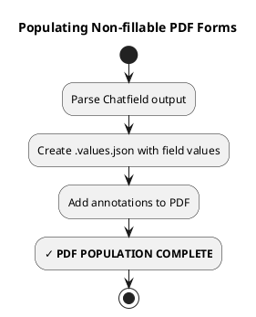

# Populating Non-fillable PDF Forms

<purpose>
After collecting data via Chatfield interview, populate the non-fillable PDF with text annotations.
</purpose>

## Process Overview



## Process

### 1. Parse Chatfield Output

Run Chatfield with `--inspect` for a final summary of all collected data:
```bash
python -m chatfield.cli --state='<basename>.chatfield/interview.db' --interview='<basename>.chatfield/interview.py' --inspect
```

Extract `field_id` and value for each field from the interview results.

### 2. Create `.values.json`

Create `<basename>.chatfield/<basename>.values.json` with the collected field values in the format expected by the annotation script:

```json
{
  "fields": [
    {
      "field_id": "full_name",
      "page": 1,
      "value": "John Doe"
    },
    {
      "field_id": "is_over_18",
      "page": 2,
      "value": "X"
    }
  ]
}
```

**Value selection priority:**
- **CRITICAL**: If a language cast exists for a field (e.g., `.as_lang_es`, `.as_lang_fr`), **always prefer it** over the raw value
- This ensures forms are populated in the form's language, not the conversation language
- The language cast name matches the form's language code (e.g., `as_lang_es` for Spanish forms)
- Only use the raw value if no language cast exists

**Boolean conversion for checkboxes:**
- Read `.form.json` for `checked_value` and `unchecked_value`
- Typically: `"X"` or `"✓"` for checked, `""` (empty string) for unchecked
- Convert Python `True`/`False` → checkbox display values

### 3. Add Annotations to PDF

Run the annotation script to create the filled PDF:

```bash
python scripts/fill_nonfillable_fields.py <basename>.pdf <basename>.chatfield/<basename>.values.json <basename>.done.pdf
```

This script:
- Reads the `.values.json` file with field values
- Reads the `.form.json` file (from extraction) with bounding box information
- Adds text annotations at the specified bounding boxes
- Creates the output PDF with all annotations

**Verification:**
- Verify `<basename>.done.pdf` exists
- Spot-check a few fields to ensure values are correctly placed

**Result**: `<basename>.done.pdf`

## Validation Checklist

<validation_checklist>
```
Non-fillable Population Validation:
- [ ] All field values extracted from CLI output
- [ ] Language casts used when available (not raw values)
- [ ] Boolean values converted to checkbox display values
- [ ] .values.json created with correct format
- [ ] fill_nonfillable_fields.py executed successfully
- [ ] Output PDF exists at expected location
- [ ] Spot-checked fields contain correct values
- [ ] Text is visible and properly positioned
```
</validation_checklist>

## Troubleshooting

**Text not visible:**
- Check font color in .form.json (should be dark, e.g., "000000" for black)
- Verify bounding boxes are correct size
- Ensure font size is appropriate for the bounding box

**Text cut off:**
- Bounding boxes may be too small
- Review validation images from extraction phase
- Consider adjusting bounding boxes and re-running extraction validation

**Wrong language:**
- Verify you're using language cast values (e.g., `as_lang_es`) not raw values
- Check that language casts were properly requested in the Form Data Model

---

**See Also:**
- ./populating-fillable.md - Population workflow for fillable PDFs
- ../extracting-form-fields/references/nonfillable-forms.md - How bounding boxes were created
- ./converting-pdf-to-chatfield.md - How the Form Data Model was built
